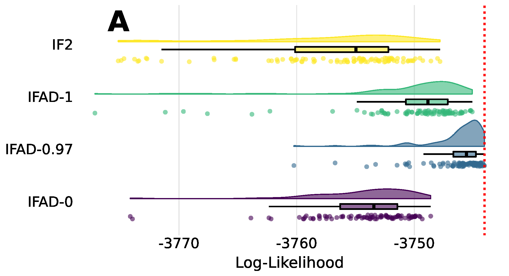
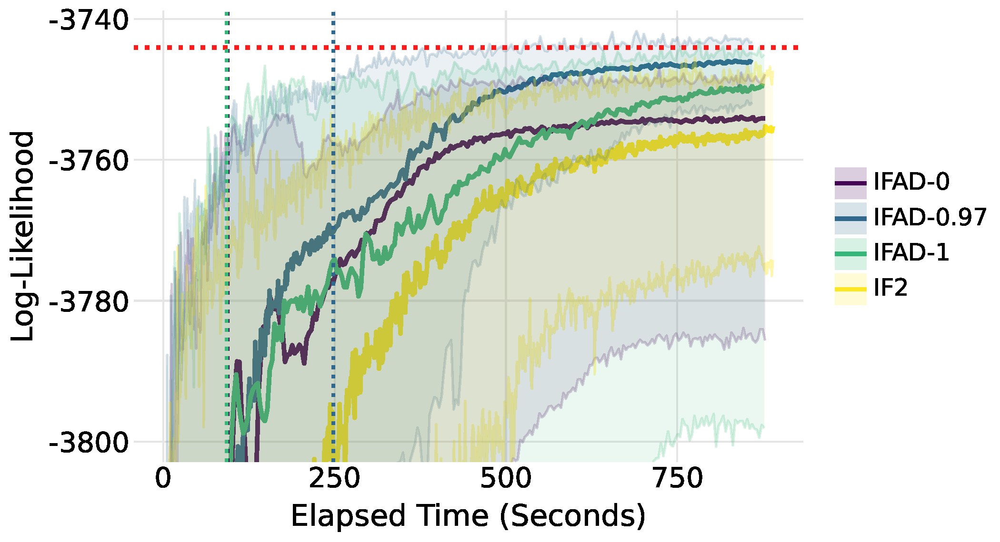
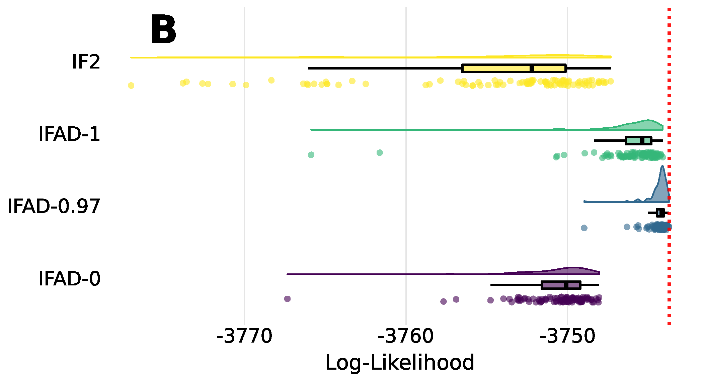
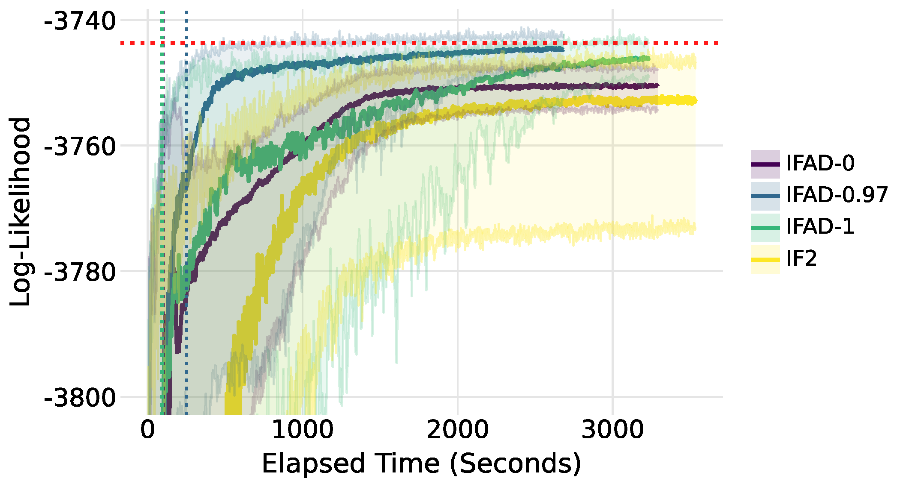
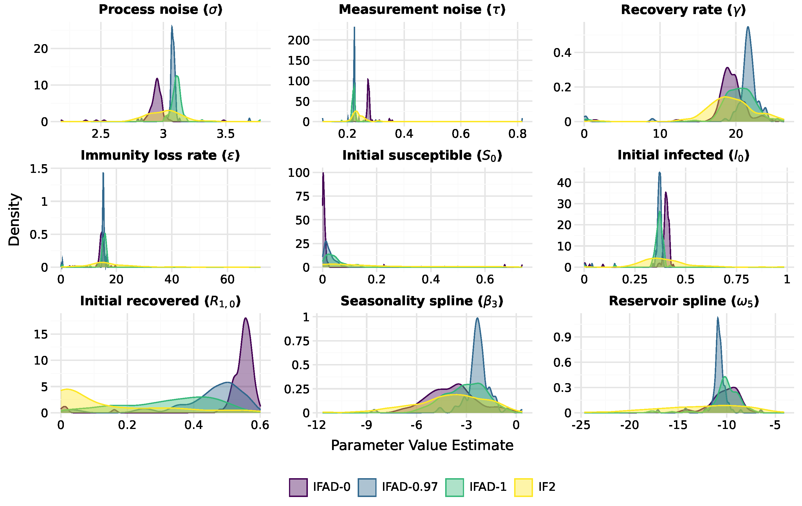

[← Back to Tutorials README](../README.html)

This tutorial demonstrates how to construct a Partially Observed Markov Process (POMP) model for cholera dynamics in Dhaka from scratch using the Differentiated Measurement Off-Parameter (DMOP) filter with the Adam optimizer in `pypomp`.
This model is available in `pypomp` as `pp.models.dhaka()`. 

We will prepare the data, build the model components, and perform parameter estimation using a hybrid approach called Iterated Filtering with Automatic Differentiation (IFAD). 
IFAD combines Iterated Filtering 2 (IF2) for a warm start with DMOP for gradient-based optimization. 
While IF2 excels at rapidly approaching the neighborhood of the maximum likelihood estimate (MLE), a gradient-based optimizer is better suited for localizing the exact MLE once nearby. 
By combining these two techniques, IFAD can estimate the MLE more accurately than either method alone.

The approach to fitting the model here mimics the approach taken in the DMOP GitHub repository [@dmop_repo].

## 1. Setup and Imports

First, we load the required libraries.

```{python}
#| label: setup
import os
import csv
import numpy as np
import pandas as pd
from plotnine import *

import jax
import jax.numpy as jnp
import jax.scipy.special as jspecial
import pypomp as pp
from pypomp.types import *

print("JAX version:", jax.__version__)
print("pypomp version:", pp.__version__)
```

## 2. Data Loading and Visualisation

We load the Dhaka cholera deaths data alongside the covariates (population size, secular trend, and B-spline seasonal terms).
Both the observations and the covariates are expected by the `Pomp` constructor to be dataframes with the time variable as the index.

```{python}
#| label: load-data
# Load observation data (cholera deaths)
df_dacca = pd.read_csv("data/dacca.csv")
ys = pd.DataFrame(
    df_dacca["cholera.deaths"].values, index=df_dacca["time"].values, columns=["deaths"]
)

# Load covariates
covart_df = pd.read_csv("data/covart.csv")
covars_df = pd.read_csv("data/covars.csv")
covars = pd.DataFrame(
    covars_df.iloc[:, 1:].values,
    index=covart_df.iloc[:, 1].values,
    columns=[
        "trend",
        "dpopdt",
        "pop",
        "seas1",
        "seas2",
        "seas3",
        "seas4",
        "seas5",
        "seas6",
    ],
)

print("Observations data points:", len(ys))
print("Covariates data points:", len(covars))
```

It is good practice to plot the observed data beforehand to get a feel for its structure and look for any issues (e.g., is a particular value unnaturally high or low, perhaps due to misrecording of the data?).

```{python}
#| label: plot-data
#| fig-width: 8
#| fig-height: 4
#| code-fold: true
(
    ggplot(df_dacca, aes(x="time", y="cholera.deaths"))
    + geom_line(color="#2b5c8f", size=0.8)
    + theme_minimal()
    + labs(
        x="Year",
        y="Monthly Deaths",
        title="Cholera Deaths in Dhaka (1891-1940)"
    )
)
```

## 3. Constructing the Dhaka Model from Scratch

We will build the cholera Susceptible-Infected-Recovered-Susceptible (SIRS) transmission model from scratch. 
This model was introduced in @king08 and used in @dmop_repo to demonstrate DMOP's strengths.
For this model, the $R$ compartment is divided into three compartments $R^1$, $R^2$, and $R^3$, each with different degrees of cholera immunity.
We write $P(t)$ for the total population, and $M_n$ for the cholera deaths in each month.
As in @king08, the transition dynamics follow a stochastic differential equation (SDE):
\begin{align*}
    dS&=\big(k \epsilon R^k+\delta(P-S)-\lambda(t) S\big)\, dt+d P-({\sigma S I}/{P})\, dB, \\
    dI&=\big(\lambda(t) S-(m+\delta+\gamma) I\big)\, dt+({\sigma S I}/{P})\, dB, \\
    dR^1&=\big(\gamma I-(k \epsilon+\delta) R^1\big)\, dt, \hspace{3ex} \dots \\
    dR^k&=\big(k \epsilon R^{k-1} -(k \epsilon+\delta) R^k\big)\, dt,
\end{align*}
with Brownian motion $B(t)$, cholera death rate $m$, recovery rate $\gamma$, mean immunity duration $1/\epsilon$, standard deviation of the force of infection $\sigma$, and population death rate $\delta=0.02$. The force of infection, $\lambda_t$, is modeled by splines $(s_j)_{j=1}^6$
\begin{equation*}
    \lambda_t=\exp\hspace{-1mm}\left(\hspace{-.5mm}\beta_{\text{trend}}(t-t_0)+\hspace{-1mm}\sum_{j=1}^{6} \beta_j s_j(t)\hspace{-1mm}\right)\hspace{-1mm}\frac{I}{P} + \exp\hspace{-1mm} \left(\sum_{j=1}^{6} \omega_j s_j(t)\hspace{-1mm}\right)\hspace{-1mm},
\end{equation*}
where the coefficients $(\beta_j)_{j=1}^6$ model seasonality in the force of infection, $\beta_{\text{trend}}$ models the trend in the force of infection, and the $\omega_j$ represent seasonality of a non-human environmental reservoir of disease.
The measurement model for observed monthly cholera deaths is
    $Y_n \sim \mathcal{N}(M_n, \tau^2M_n^2)$,
where $M_n=\gamma\int_{t_{n-1}}^{t_n}I(s)\, ds$ is the modeled cholera deaths in that month.

This is a continuous-time model, but we can only simulate in discrete steps. 
We numerically solve this SDE using Euler's method with a time step of $1/20$ months, or 20 steps per observation period, matching @king08.

We define the default parameter values and state variables first:

```{python}
#| label: model-parameters
# Model parameters
theta_default = {
    "gamma": 20.8,  # recovery rate
    "epsilon": 19.1,  # waning immunity rate for severe infections
    "rho": 0.0,  # waning immunity rate for inapparent infections
    "m": 0.06,  # cholera-specific mortality rate
    "c": 1.0,  # fraction of infections leading to severe disease
    "beta_trend": -0.00498,  # transmission secular trend slope
    **{
        f"bs{i + 1}": float(b)
        for i, b in enumerate([0.747, 6.38, -3.44, 4.23, 3.33, 4.55])
    },
    "sigma": 3.13,  # environmental noise intensity
    "tau": 0.23,  # measurement error standard deviation
    "alpha": 1.0,  # non-linear transmission exponent
    "delta": 0.02,  # natural mortality rate
    "S_0": 0.621,  # Proportion of initial susceptible individuals
    "I_0": 0.378,  # Proportion of initial infectious individuals
    "Y_0": 0.0,  # Proportion of initial inapparent infections
    "R1_0": 0.000843,  # Proportions of initial recovered individuals
    "R2_0": 0.000972,
    "R3_0": 1.16e-07,
    **{
        f"omegas{i + 1}": float(omega)
        for i, omega in enumerate(
            jnp.log(jnp.array([0.184, 0.0786, 0.0584, 0.00917, 0.000208, 0.0124]))
        )
    },
}

statenames = ["S", "I", "Y", "Mn", "R1", "R2", "R3", "count"]
```

Note that the Dhaka model code, carried over from the R package `pomp`, includes parameters not used in the present model, such as the initial proportion of inapparent infections, $Y_0$. 
We set them to values that effectively remove them from the model.

To accumulate the total number of deaths over each month for use by the measurement distribution, we will designate the deaths `"Mn"` as an accumulative state variable.

```{python}
accumvars = ["Mn"]
```

### Initial State Simulator (`rinit`)

This simulator sets up the states at $t_0$.

```{python}
#| label: rinit-definition
def rinit(theta_: ParamDict, key: RNGKey, covars: CovarDict, t0: InitialTimeFloat):
    S_0 = theta_["S_0"]
    I_0 = theta_["I_0"]
    Y_0 = theta_["Y_0"]
    R0 = jnp.array([theta_[f"R{i}_0"] for i in range(1, 4)])

    total_sum = S_0 + I_0 + Y_0 + jnp.sum(R0)
    pop = covars["pop"]

    S = pop * S_0 / total_sum
    I = pop * I_0 / total_sum
    Y = pop * Y_0 / total_sum
    R = pop * R0 / total_sum

    Mn = 0.0
    count = 0.0
    return {
        "S": S,
        "I": I,
        "Y": Y,
        "Mn": Mn,
        "R1": R[0],
        "R2": R[1],
        "R3": R[2],
        "count": count,
    }
```

### Process Model Simulator (`rproc`)

This simulates one Euler step of the model dynamics described above. 

```{python}
#| label: rproc-definition
def rproc(
    X_: StateDict,
    theta_: ParamDict,
    key: RNGKey,
    covars: CovarDict,
    t: TimeFloat,
    dt: StepSizeFloat,
):
    S, I, Y, deaths, count = X_["S"], X_["I"], X_["Y"], X_["Mn"], X_["count"]
    pts = jnp.array([X_["R1"], X_["R2"], X_["R3"]])
    trend, dpopdt, pop = covars["trend"], covars["dpopdt"], covars["pop"]
    seas = jnp.array([covars[f"seas{i}"] for i in range(1, 7)])
    gamma, deltaI, rho = theta_["gamma"], theta_["m"], theta_["rho"]
    beta_trend, sd_beta, alpha = theta_["beta_trend"], theta_["sigma"], theta_["alpha"]
    delta, clin, eps = theta_["delta"], theta_["c"], theta_["epsilon"]
    omegas = jnp.array([theta_[f"omegas{i}"] for i in range(1, 7)])
    bs = jnp.array([theta_[f"bs{i}"] for i in range(1, 7)])

    nrstage = 3
    std = jnp.sqrt(dt)

    neps = eps * nrstage  # rate of waning stages
    passages = jnp.zeros(nrstage + 1)

    # Calculate seasonal B-spline terms
    beta = jnp.exp(beta_trend * trend + jnp.dot(bs, seas))
    omega = jnp.exp(jnp.dot(omegas, seas))

    subkey, key = jax.random.split(key)
    dw = jax.random.normal(subkey) * std

    effI = (I / pop) ** alpha
    births = dpopdt + delta * pop
    passages = passages.at[0].set(gamma * I)
    ideaths = delta * I
    disease = deltaI * I
    ydeaths = delta * Y
    wanings = rho * Y

    rdeaths = pts * delta
    passages = passages.at[1:].set(pts * neps)

    # Multiplicative Gaussian white noise perturbation to transmission
    infections = (omega + (beta + sd_beta * dw / dt) * effI) * S
    sdeaths = delta * S

    S += (births - infections - sdeaths + passages[nrstage] + wanings) * dt
    I += (clin * infections - disease - ideaths - passages[0]) * dt
    Y += ((1 - clin) * infections - ydeaths - wanings) * dt

    pts = pts + (passages[:-1] - passages[1:] - rdeaths) * dt
    deaths = deaths + disease * dt

    # Flag negative state occurrences
    count = count + jnp.any(jnp.hstack([jnp.array([S, I, Y, deaths]), pts]) < 0)

    # Clip values to zero to ensure stability
    S = jnp.clip(S, 0)
    I = jnp.clip(I, 0)
    Y = jnp.clip(Y, 0)
    pts = jnp.clip(pts, 0)
    deaths = jnp.clip(deaths, 0)

    return {
        "S": S,
        "I": I,
        "Y": Y,
        "Mn": deaths,
        "R1": pts[0],
        "R2": pts[1],
        "R3": pts[2],
        "count": count,
    }
```

### Measurement Model (`dmeas` and `rmeas`)

Evaluates the likelihood of observed deaths and simulates new observations according to the measurement model described above:

```{python}
#| label: dmeas-rmeas-definition
def dmeas_helper(y, deaths, v, tol, ltol):
    return jnp.logaddexp(
        jax.scipy.stats.norm.logpdf(y, loc=deaths, scale=v + tol), ltol
    ).reshape(-1)


def dmeas_helper_tol(y, deaths, v, tol, ltol):
    return jnp.array([ltol])


def dmeas(
    Y_: ObservationDict,
    X_: StateDict,
    theta_: ParamDict,
    covars: CovarDict,
    t: TimeFloat,
):
    deaths = X_["Mn"]
    count = X_["count"]
    tol = 1.0e-18
    ltol = jnp.log(tol)
    tau = theta_["tau"]
    v = tau * deaths
    y = Y_["deaths"]
    result = jax.lax.cond(
        jnp.logical_or((1 - jnp.isfinite(v)).astype(bool), count > 0),
        dmeas_helper_tol,
        dmeas_helper,
        *(y, deaths, v, tol, ltol),
    )
    return jnp.reshape(result, ())


def rmeas(
    X_: StateDict,
    theta_: ParamDict,
    key: RNGKey,
    covars: CovarDict,
    t: TimeFloat,
):
    deaths = X_["Mn"]
    tau = theta_["tau"]
    v = tau * deaths
    return jax.random.normal(key) * v + deaths
```

### Parameter Transformations (`to_est` and `from_est`)

Here, we define functions to transform positive constraints to the real line and back.
Notably, we use a barycentric transformation for the initial proportions to ensure that they sum to 1. 

```{python}
#| label: par-trans-definition
def to_est(theta: ParamDict) -> ParamDict:
    IVP_list = ["S_0", "I_0", "Y_0", "R1_0", "R2_0", "R3_0"]
    IVPs = jnp.array([theta[k] for k in IVP_list])
    IVP_ests = jnp.log(IVPs / jnp.sum(IVPs))
    return {
        "gamma": jnp.log(theta["gamma"]),
        "m": jnp.log(theta["m"]),
        "rho": jnp.log(theta["rho"]),
        "epsilon": jnp.log(theta["epsilon"]),
        "c": jspecial.logit(theta["c"]),
        "beta_trend": theta["beta_trend"] * 100,
        "sigma": jnp.log(theta["sigma"]),
        "tau": jnp.log(theta["tau"]),
        "alpha": jnp.log(theta["alpha"]),
        "delta": jnp.log(theta["delta"]),
        **{k: IVP_ests[i] for i, k in enumerate(IVP_list)},
        **{f"bs{i}": theta[f"bs{i}"] for i in range(1, 7)},
        **{f"omegas{i}": theta[f"omegas{i}"] for i in range(1, 7)},
    }


def from_est(theta: ParamDict) -> ParamDict:
    IVP_list = ["S_0", "I_0", "Y_0", "R1_0", "R2_0", "R3_0"]
    IVP_ests = jnp.exp(jnp.array([theta[k] for k in IVP_list]))
    IVPs = IVP_ests / jnp.sum(IVP_ests)
    return {
        "gamma": jnp.exp(theta["gamma"]),
        "m": jnp.exp(theta["m"]),
        "rho": jnp.exp(theta["rho"]),
        "epsilon": jnp.exp(theta["epsilon"]),
        "c": jspecial.expit(theta["c"]),
        "beta_trend": theta["beta_trend"] / 100,
        "sigma": jnp.exp(theta["sigma"]),
        "tau": jnp.exp(theta["tau"]),
        "alpha": jnp.exp(theta["alpha"]),
        "delta": jnp.exp(theta["delta"]),
        **{k: IVPs[i] for i, k in enumerate(IVP_list)},
        **{f"bs{i}": theta[f"bs{i}"] for i in range(1, 7)},
        **{f"omegas{i}": theta[f"omegas{i}"] for i in range(1, 7)},
    }


ptrans = pp.ParTrans(to_est=to_est, from_est=from_est)
```

### Model Initialization

We instantiate our custom model with `pp.Pomp`. 

`nstep` sets the number of `rproc` steps to happen between observations.
The user may instead define a `dt` parameter to set the step size, in which case `nstep` will be set per observation interval.

```{python}
#| label: instantiate-model
dacca_obj = pp.Pomp(
    rinit=rinit,
    rproc=rproc,
    dmeas=dmeas,
    rmeas=rmeas,
    ys=ys,
    t0=1891.0,
    nstep=20,
    accumvars=accumvars,
    theta=theta_default,
    covars=covars,
    statenames=statenames,
    par_trans=ptrans,
)
```

## 4. Setup for Parameter Estimation

When fitting POMP models, it can be helpful to use a "run level" variable to control how much effort is put into the computation (e.g., number of particles, number of iterations). 
This allows one to quickly test code with few iterations and few particles, then increase the effort as confidence in the code grows.

```{python}
#| label: prep-search
MAIN_SEED = 631409
key = jax.random.key(MAIN_SEED)
np.random.seed(MAIN_SEED)

RUN_LEVEL = int(os.environ.get("RUN_LEVEL", "1"))
NREPS_FITR = (2, 3, 20, 100)[RUN_LEVEL - 1]
NP_FITR = (2, 5, 100, 5000)[RUN_LEVEL - 1]
M_MIF = (2, 5, 100, 175)[RUN_LEVEL - 1]
M_TRAIN = (2, 20, 40, 175)[RUN_LEVEL - 1]
NP_EVAL = (2, 5, 1000, 5000)[RUN_LEVEL - 1]
NREPS_EVAL = (2, 5, 20, 36)[RUN_LEVEL - 1]
WARMUP = (1, 5, 10, 10)[RUN_LEVEL - 1]
```

We define the box for sampling starting parameter values and the random walk standard deviations for IF2.

Some parameters are designated as initial value parameters (IVPs), which are parameters that only have a direct effect on the system at $t_0$. 
In our case, these are the initial proportions of the population in each compartment.
Because perturbing their value has no effect on the evolution of the system past $t_0$, perturbations only add noise to the parameter estimate. 
Therefore, we set `init_names` in `pp.RWSigma` to the names of the IVPs to tell `Pomp.mif` to only perturb these values just before $t_0$.

```{python}
#| label: prep-search-code
# Random walk standard deviations
DEFAULT_SD = 0.02
DEFAULT_IVP_SD = DEFAULT_SD * 8
RW_SD = pp.RWSigma(
    sigmas={
        **{
            k: DEFAULT_SD
            for k in ["gamma", "m", "epsilon", "beta_trend", "sigma", "tau"]
        },
        **{f"bs{i}": DEFAULT_SD for i in range(1, 7)},
        **{f"omegas{i}": DEFAULT_SD for i in range(1, 7)},
        **{k: DEFAULT_IVP_SD for k in ["S_0", "I_0", "R1_0", "R2_0", "R3_0"]},
        **{k: 0.0 for k in ["rho", "c", "alpha", "delta", "Y_0"]},
    },
    init_names=["S_0", "I_0", "Y_0", "R1_0", "R2_0", "R3_0"],
)


# Learning rate linear warmup function.
# This helps the Adam momentum build up gradually.
def w(v):
    if v == 0.0:
        return 0.0
    return np.concatenate(
        [np.linspace(v * 0.1, v, WARMUP), np.full(M_TRAIN - WARMUP, v)]
    )


DEFAULT_ETA = 0.1
DEFAULT_IVP_ETA = DEFAULT_ETA / 2
eta = pp.LearningRate(
    {
        "gamma": w(DEFAULT_ETA * 0.5),
        "epsilon": w(DEFAULT_ETA),
        "rho": 0.0,
        "m": w(DEFAULT_ETA),
        "c": 0.0,
        "alpha": 0.0,
        "delta": 0.0,
        "beta_trend": w(DEFAULT_ETA * 0.5),
        **{f"bs{i + 1}": w(DEFAULT_ETA) for i in range(6)},
        "sigma": w(DEFAULT_ETA * 0.5),
        "tau": w(DEFAULT_ETA * 0.5),
        **{f"omegas{i + 1}": w(DEFAULT_ETA) for i in range(6)},
        "S_0": w(DEFAULT_IVP_ETA),
        "I_0": w(DEFAULT_IVP_ETA),
        "Y_0": 0.0,
        "R1_0": w(DEFAULT_IVP_ETA),
        "R2_0": w(DEFAULT_IVP_ETA),
        "R3_0": w(DEFAULT_IVP_ETA),
    }
)

# Parameters boundaries for search initialization
params_box = {
    "gamma": (10.0, 40.0),
    "m": (0.03, 0.60),
    "rho": (0.0, 0.0),
    "epsilon": (0.20, 30.0),
    "c": (1.0, 1.0),
    "alpha": (1.0, 1.0),
    "delta": (0.02, 0.02),
    "beta_trend": (-0.01, 0.00),
    "sigma": (1.0, 5.0),
    "tau": (0.10, 0.50),
    "bs1": (-4.0, 4.0),
    "bs2": (0.0, 8.0),
    "bs3": (-4.0, 4.0),
    "bs4": (0.0, 8.0),
    "bs5": (0.0, 8.0),
    "bs6": (0.0, 8.0),
    "omegas1": (-10.0, 0.0),
    "omegas2": (-10.0, 0.0),
    "omegas3": (-10.0, 0.0),
    "omegas4": (-10.0, 0.0),
    "omegas5": (-10.0, 0.0),
    "omegas6": (-10.0, 0.0),
    "S_0": (0.0, 1.0),
    "I_0": (0.0, 1.0),
    "Y_0": (0.0, 0.0),
    "R1_0": (0.0, 1.0),
    "R2_0": (0.0, 1.0),
    "R3_0": (0.0, 1.0),
}

key, subkey = jax.random.split(key)
initial_params_list = pp.Pomp.sample_params(params_box, NREPS_FITR, key=subkey)
```

## 5. Optimizing Parameters using IFAD

We now optimize the parameters using IFAD.

```{python}
#| label: run-dmop

key, subkey = jax.random.split(key)
# Warm up with an IF2 search
dacca_obj.mif(
    theta=initial_params_list,
    rw_sd=RW_SD,
    M=M_MIF,
    a=0.5,
    J=NP_FITR,
    key=subkey,
)
```

We use `cosine_decay()` to apply a cosine decay schedule to the learning rate. 
This gradually reduces the learning rate down to 5% of its baseline value over $M_{\text{train}}$ iterations, which helps fine-tune the parameter estimates toward the end of the search.

`alpha` is an important algorithmic parameter controlling the extent to which the particle weights in DMOP are discounted at each time step. 
If $\alpha = 1$, the weights are not discounted at all, whereas $\alpha = 0$ fully discounts the weights, setting each equal to 1 after each step.
The intervening values interpolate between these extremes, introducing a bias-variance tradeoff wherein values close to 1 have higher variance but lower bias, while values close to 0 have lower variance but higher bias.
For the Dhaka model, $\alpha = 0.97$ yields the lowest mean squared error for the score estimates for the trend in transmission at the MLE found in @king08, so we proceed with this value.

```{python}
#| label: run-dmop-2

# Run DMOP with Adam
dacca_obj.train(
    J=NP_FITR,
    M=M_TRAIN,
    eta=eta.cosine_decay(final_factor=0.05, M=M_TRAIN),
    alpha=0.97,
    optimizer=pp.Adam(),
)
```

Because estimating the log-likelihood at the MLE using the maximum of independent estimates is biased upward, we run the particle filter twice: once to get a log-likelihood estimate for each parameter set, and once to re-estimate the best log-likelihood from the first round, accounting for this bias.  
Running `prune(n=1, refill=False)` sets `dacca_obj.theta` to contain just the best parameter set from the first round of particle filtering, so running `pfilter()` once more gives the re-estimated log-likelihoods for just this set. 

```{python}
#| label: eval-results
# Evaluate results
dacca_obj.pfilter(J=NP_EVAL, reps=NREPS_EVAL)

# Re-estimate the log-likelihood of the best model
dacca_obj.prune(n=1, refill=False)
dacca_obj.pfilter(J=NP_EVAL, reps=NREPS_EVAL)
```

## 6. Comparing Optimization Methods

This section displays the IF2 and IFAD results for the Dhaka model computed in @dmop_repo, which follows the approach above for IFAD-0.97 in addition to fitting models with IF2 alone, IFAD-0, and IFAD-1.
For more details and analysis, see @dmop_repo.

::: {.panel-tabset}

## Comparable Computational Effort

The figures below show the results obtained under comparable computational effort, where each model was given about as much time as IFAD-0.97 required to reach its MLE. 

### Raincloud Plot of Final Log-Likelihoods

Plots the log-likelihood distribution across replicates.
IFAD-0.97 yields the best results overall.
The dotted red line shows the maximized log-likelihood.

{width=85%}

### Convergence Traces Comparison (Time-Scaled)

This section shows the log-likelihood search traces.
The shaded regions cover the area between the 10th and 100th percentiles of log-likelihood estimates at each iteration.
We use a dotted red line to display the MLE.
The vertical dotted lines indicate where the IFAD runs switch from IF2 to Adam optimization.
Some log-likelihood estimates appear to be above the MLE; this is because the estimates prior to the final iteration use just 1 replicate instead of 36 replicates to estimate the log-likelihood, which leads to larger Monte Carlo variance.

{width=85%}

## Extended Computational Effort

The figures below show the results obtained under extended computational effort.

### Raincloud Plot of Final Log-Likelihoods

Plots the log-likelihood distribution across replicates.
Note how IFAD-0.97 exhibits very low Monte Carlo variance, with each search converging to similar values. 

{width=85%}

### Convergence Traces Comparison (Time-Scaled)

This section shows the log-likelihood search traces.
Aside from IFAD-1, each method appears to heavily plateau by the end. 
IFAD-1 shows potential for continued improvement, likely because it is unbiased, but it is slow to converge due to its high variance. 

{width=85%}

### Parameter Density Plots

This section shows density plots of final parameter estimates across the replicates. 
Again, the estimates for IFAD-0.97 typically exhibit very low Monte Carlo variance, although IFAD-0 shows lower variance for $S_0$ and $R_{1,0}$. 
IF2 generally has the highest Monte Carlo variance amongst the methods. 

{width=100%}

:::

### Best Log-Likelihoods and Computational Times

This table displays the log-likelihood statistics and elapsed times obtained from the final particle filter evaluations across the replicates for the models.
The best log-likelihood found by IFAD-0.97 does not increase much from optimizing for longer, suggesting that the associated parameter estimates are very close to the true MLE. 
The other methods fall short of this, but they do improve at least somewhat from running for longer, with IFAD-1 catching up to IFAD-0.97 in terms of the best log-likelihood. 

| Optimization Method | Best Log-Likelihood | Median Log-Likelihood | IF2 time (s) | DMOP time (s) |
|:---|:---:|:---:|:---:|:---:|
| **Comparable Computational Effort** | | | | |
| IFAD-0.97 | -3744.17 | -3745.77 | 244 | 615 |
| IFAD-1 | -3745.12 | -3749.12 | 89 | 788 |
| IF2 | -3747.82 | -3755.41 | 889 | — |
| IFAD-0 | -3748.69 | -3753.88 | 90 | 788 |
| **Extended Computational Effort** | | | | |
| IFAD-0.97 | -3744.19 | -3744.22 | 246 | 2435 |
| IFAD-1 | -3744.19 | -3745.46 | 89 | 3145 |
| IF2 | -3747.02 | -3750.14 | 3534 | — |
| IFAD-0 | -3747.97 | -3752.41 | 93 | 3198 |

