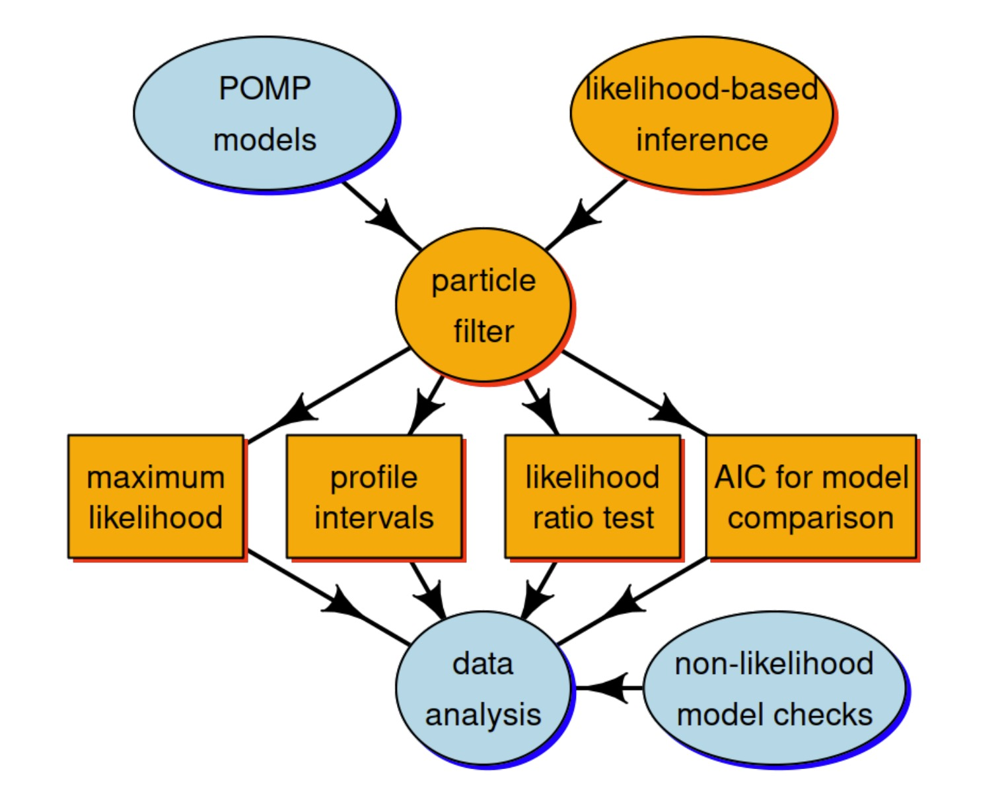

```{python}
#| echo: false
#| output: false
"trying an empty chunk to see if it helps compilation"
```

## Objectives

This lesson develops likelihood-based inference for POMP models, with a focus
on the particle filter algorithm for computing the likelihood.

Students completing this lesson will:

1. Gain an understanding of the nature of the problem of likelihood computation for POMP models.

2. Be able to explain the simplest particle filter algorithm.

3. Gain experience in the visualization and exploration of likelihood surfaces.

4. Be able to explain the tools of likelihood-based statistical inference that become available given numerical accessibility of the likelihood function.


## 

{width=8cm}

The Monte Carlo technique called the **particle filter** is central for connecting the higher-level ideas of POMP models and likelihood-based inference to the lower-level tasks involved in carrying out data analysis.

##

We employ a standard toolkit for likelihood-based inference:

* Maximum likelihood estimation

* Profile likelihood confidence intervals

* Likelihood ratio tests for model selection

* Other likelihood-based model comparison tools such as AIC

We seek to better understand these tools, and to figure out how to implement and interpret them in the specific context of POMP models.


## The Likelihood Function

Data are a sequence of $N$ observations, denoted $y^*_{1:N}$.
A statistical model is a density function $f_{Y_{1:N}}(y_{1:N}; \theta)$ which defines a probability distribution for each value of a parameter vector $\theta$. To perform statistical inference, we must decide, among other things, for which (if any) values of $\theta$ it is reasonable to model $y^*_{1:N}$ as a random draw from $f_{Y_{1:N}}(y_{1:N}; \theta)$.

**The likelihood function** is:
$$
\lik(\theta) = f_{Y_{1:N}}(y^*_{1:N}; \theta),
$$
the density function evaluated at the data. It is often convenient to work with the **log-likelihood function**:
$$
\loglik(\theta) = \log \lik(\theta) = \log f_{Y_{1:N}}(y^*_{1:N}; \theta).
$$
- The basis for modern frequentist, Bayesian, and information-theoretic inference. Introduced by [@Fisher1922].


## A Simulator is Implicitly a Statistical Model

For simple statistical models, we may describe the model by explicitly writing the density function $f_{Y_{1:N}}(y_{1:N}; \theta)$. One may then ask how to simulate a random variable $Y_{1:N} \sim f_{Y_{1:N}}(y_{1:N}; \theta)$.

* For many dynamic models it is much more convenient to define the model via a procedure to **simulate** the random variable $Y_{1:N}$. This implicitly defines the corresponding density $f_{Y_{1:N}}(y_{1:N}; \theta)$.

* For a complicated simulation procedure, it may be difficult or impossible to write down or even compute $f_{Y_{1:N}}(y_{1:N}; \theta)$ exactly.

It is important to bear in mind that **the likelihood function exists even when we don't know what it is!**


## The Likelihood for a POMP Model

Recall the structure of a POMP model:

- Measurements, $Y_n$, at time $t_n$ depend on the latent process, $X_n$, at that time.

- The Markov property asserts that latent process variables depend on their value at the previous timestep.

- The distribution of $X_{n+1}$, conditional on $X_n$, is independent of $X_k$ for $k < n$ and $Y_k$ for $k \leq n$.

- The distribution of $Y_n$, conditional on $X_n$, is independent of all other variables.


##

\begin{figure}[htbp]     
  \centering             
  \begin{tikzpicture}[
      scale=0.5,
      every node/.style={transform shape},
      node distance=1.5cm, auto, >=Stealth]
    
      % Styles
  \tikzstyle{state} = [rectangle, draw, minimum size=1cm, font=\small]
  \tikzstyle{observation} = [rectangle, draw, minimum size=1cm, font=\small]
  \tikzstyle{label} = [font=\bfseries\small, align=center]
  \tikzstyle{model} = [font=\itshape\small]

  % Nodes
  \node[state] (x0) {$X_0$};
  \node[state, right=of x0] (x1) {$X_1$};
  \node[right=1cm of x1] (dots1) {$\cdots$};
  \node[state, right=1cm of dots1] (xn1) {$X_{n-1}$};
  \node[state, right=of xn1] (xn) {$X_n$};
  \node[state, right=of xn] (xnp1) {$X_{n+1}$};
  \node[observation, above=of x1] (y1) {$Y_1$};
  \node[observation, above=of xn1] (yn1) {$Y_{n-1}$};
  \node[observation, above=of xn] (yn) {$Y_n$};
  \node[observation, above=of xnp1] (ynp1) {$Y_{n+1}$};

  % Labels
  \node[label, left=1cm of x0] {States};
  \node[label, left=2.25cm of y1] {Observations};

  % Time Labels
  \node[below=1.5cm of x0] {$t_0$};
  \node[below=1.5cm of x1] {$t_1$};
  \node[below=1.8cm of dots1] {$\cdots$};
  \node[below=1.5cm of xn1] {$t_{n-1}$};
  \node[below=1.5cm of xn] {$t_n$};
  \node[below=1.5cm of xnp1] {$t_{n+1}$};

  % Paths
  \path[->]
    (x0) edge (x1)
    (x1) edge (dots1)
    (dots1) edge (xn1)
    (xn1) edge (xn)
    (xn) edge (xnp1)
    (x1) edge[dashed] (y1)
    (xn1) edge[dashed] (yn1)
    (xn) edge[dashed] (yn)
    (xnp1) edge[dashed] (ynp1);

  % Model Labels
  \node[model, below=1.0cm of dots1, align=center] (processmodel) {Process model};
  \node[model, above=3.3cm of dots1, align=center] (measurementmodel) {Measurement model}; 

\usetikzlibrary{calc} 
  % Coordinate for new arrow
  \coordinate (midarrow) at ($(x1)!0.5!(y1)$);
  \coordinate (midbrrow) at ($(xn1)!0.5!(yn1)$);
  \coordinate (midcrrow) at ($(xn)!0.5!(yn)$);
  \coordinate (middrrow) at ($(xnp1)!0.5!(ynp1)$);
  \coordinate (miderrow) at ($(x0)!0.5!(x1)$);
  \coordinate (midfrrow) at ($(x1)!0.5!(xn1)$);
  \coordinate (midgrrow) at ($(xn1)!0.5!(xn)$);
  \coordinate (midhrrow) at ($(xn)!0.5!(xnp1)$);
  
  % New arrow
  \draw[->, dashed] (midarrow) -- (measurementmodel);
  \draw[->, dashed] (midbrrow) -- (measurementmodel);
  \draw[->, dashed] (midcrrow) -- (measurementmodel);
  \draw[->, dashed] (middrrow) -- (measurementmodel);
  \draw[->, dashed] (miderrow) -- (processmodel);
  \draw[->, dashed] (midfrrow) -- (processmodel);
  \draw[->, dashed] (midgrrow) -- (processmodel);
  \draw[->, dashed] (midhrrow) -- (processmodel);

  
  % Add horizontal arrow between t_n and process model
  \coordinate (startarrow) at ($(x0) - (0,2)$);
  \coordinate (endarrow) at ($(xnp1) - (0,2)$);
  \draw[->] (startarrow) -- (endarrow) node[midway, below] {};
  \end{tikzpicture}
  \label{fig:pomp-centered}
\end{figure}

##

The joint density factors as:
\small
$$
\begin{aligned}
&f_{X_{0:N}, Y_{1:N}}(x_{0:N}, y_{1:N}; \theta) \\
&\quad = f_{X_0}(x_0; \theta) \prod_{n=1}^{N} f_{X_n|X_{n-1}}(x_n|x_{n-1}; \theta) \, f_{Y_n|X_n}(y_n|x_n; \theta).
\end{aligned}
$$
\normalsize
The marginal density for the sequence of measurements, $Y_{1:N}$, evaluated at the data, $y^*_{1:N}$, is:
$$
\lik(\theta) = f_{Y_{1:N}}(y^*_{1:N}; \theta) = \int f_{X_{0:N}, Y_{1:N}}(x_{0:N}, y^*_{1:N}; \theta) \, dx_{0:N}.
$$

This integral is **high dimensional** and, except for the simplest cases, cannot be reduced analytically.


## Monte Carlo Likelihood by Direct Simulation

- First, let's rewrite the likelihood integral using an equivalent factorization:
$$
\lik(\theta) = \int \left\{ \prod_{n=1}^{N} f_{Y_n|X_n}(y^*_n|x_n; \theta) \right\}
f_{X_{0:N}}(x_{0:N}; \theta) \, dx_{0:N}.
$$

- Notice that the likelihood can be written as an expectation:
$$
\lik(\theta) = \E\left[ \prod_{n=1}^{N} f_{Y_n|X_n}(y^*_n|X_n; \theta) \right],
$$
where the expectation is taken with $X_{0:N} \sim f_{X_{0:N}}(x_{0:N}; \theta)$.

##

- Using a law of large numbers, we can approximate:
$$
\lik(\theta) \approx \frac{1}{J} \sum_{j=1}^{J} \prod_{n=1}^{N} f_{Y_n|X_n}(y^*_n|X^j_n; \theta),
$$
where $\{X^j_{0:N}, j = 1, \ldots, J\}$ is a Monte Carlo sample drawn from $f_{X_{0:N}}(x_{0:N}; \theta)$.

##

**Problems with this naive approach:**

- This scales poorly with dimension. It requires Monte Carlo effort that scales **exponentially** with the length of the time series.

- Once a simulated trajectory diverges from the data, it will seldom come back.

- Simulations that lose track of the data make negligible contributions to the likelihood estimate.

## The Particle Filter

Fortunately, we can compute the likelihood for a POMP model by a much more efficient algorithm.

We proceed by factorizing the likelihood differently:
$$
\lik(\theta) = \prod_{n=1}^{N} f_{Y_n|Y_{1:n-1}}(y^*_n|y^*_{1:n-1}; \theta)
$$
\footnotesize
$$
= \prod_{n=1}^{N} \int f_{Y_n|X_n}(y^*_n|x_n; \theta) \, f_{X_n|Y_{1:n-1}}(x_n|y^*_{1:n-1}; \theta) \, dx_n.
$$
\normalsize

##

**The prediction formula** (from Markov property):
\footnotesize
$$
\begin{aligned}
&f_{X_n|Y_{1:n-1}}(x_n|y^*_{1:n-1}; \theta) \\
&= \int f_{X_n|X_{n-1}}(x_n|x_{n-1}; \theta) \, f_{X_{n-1}|Y_{1:n-1}}(x_{n-1}|y^*_{1:n-1}; \theta) \, dx_{n-1}.
\end{aligned}
$$
\normalsize

**The filtering formula** (from Bayes' theorem):
\footnotesize
$$
f_{X_n|Y_{1:n}}(x_n|y^*_{1:n}; \theta) = \frac{f_{Y_n|X_n}(y^*_n|x_n; \theta) \, f_{X_n|Y_{1:n-1}}(x_n|y^*_{1:n-1}; \theta)}
{\int f_{Y_n|X_n}(y^*_n|u_n; \theta) \, f_{X_n|Y_{1:n-1}}(u_n|y^*_{1:n-1}; \theta) \, du_n}.
$$
\normalsize

##

This suggests we keep track of two distributions at each time $t_n$:

- The **prediction distribution**: $f_{X_n|Y_{1:n-1}}(x_n|y^*_{1:n-1})$

- The **filtering distribution**: $f_{X_n|Y_{1:n}}(x_n|y^*_{1:n})$

The particle filter uses Monte Carlo techniques to sequentially estimate these integrals. Hence, the alternative name of **sequential Monte Carlo (SMC)**.

## Basic Particle Filter Algorithm

1. Suppose $X^F_{n-1,j}$, $j = 1, \ldots, J$ is a set of $J$ points drawn from the filtering distribution at time $t_{n-1}$.

2. We obtain a sample $X^P_{n,j}$ from the prediction distribution at time $t_n$ by simply **simulating** the process model:
$$
X^P_{n,j} \sim \text{process}(X^F_{n-1,j}, \theta), \quad j = 1, \ldots, J.
$$

##

3. Having obtained $X^P_{n,j}$, we obtain a sample from the filtering distribution at time $t_n$ by **resampling** from $\{X^P_{n,j}, j \in 1:J\}$ with weights:
$$
w_{n,j} = f_{Y_n|X_n}(y^*_n|X^P_{n,j}; \theta).
$$

4. The conditional likelihood
$$
\lik_n(\theta) = f_{Y_n|Y_{1:n-1}}(y^*_n|y^*_{1:n-1}; \theta)
$$
is approximated by:
$$
\hat{\lik}_n(\theta) \approx \frac{1}{J} \sum_{j} f_{Y_n|X_n}(y^*_n|X^P_{n,j}; \theta).
$$

##

5. We iterate this procedure through the data, one step at a time, alternately simulating and resampling, until we reach $n = N$.

6. The full log-likelihood then has approximation:
$$
\loglik(\theta) = \log \lik(\theta) = \sum_{n} \log \lik_n(\theta) \approx \sum_{n} \log \hat{\lik}_n(\theta).
$$

## Block diagram of a particle filter

\begin{center}
\begin{tikzpicture}[
  square/.style={rectangle, draw=black, minimum width=4.2cm, minimum height=0.7cm, rounded corners=.1cm,font=\ttfamily},
  >/.style={shorten >=0.4mm}, % redefine arrow to stop short of node
  >/.tip={Stealth[length=2.5mm,width=1.5mm]} % redefine arrow style
]
\tikzset{>={}}; % this is needed to implement the arrow redefinition
  \node (initialize)   at (0,6)  [square] {initialize: rinit};
  \node (predict)  at (0,4.5)  [square] {predict: rprocess};
  \node (weight)  at (0,3)  [square] {weight: dmeasure};
  \node (filter)  at (0,1.5)  [square] {filter: resample};
  \node (N) at (5.5,3)  [draw,diamond,aspect=2.5] {\texttt{N observations}};
  \node (Np) at (0,7.5)  [draw,diamond,aspect=2.5,color=red] {\texttt{Np particles}};
  \draw[->] (initialize) -- (predict);
  \draw[->] (predict) -- (weight);
  \draw[->] (weight) -- (filter);
  \draw[->] (filter.east) -| (N);
  \draw[->] (N.north) |- (predict.east);
  \draw[color=red, rounded corners, thick, dashed] (Np.east) -| (2.7,0.7) -- (-2.7,0.7) |- (Np.west);
\end{tikzpicture}
\end{center}


## Particle filter steps

1. **Initialize**: `rinit`

2. **Predict**: `rproc` (simulate forward)

3. **Weight**: `dmeas` (evaluate measurement density)

4. **Filter**: resample particles according to weights

5. Repeat steps 2-4 for $N$ observations

The particle filter provides an **unbiased** estimate of the likelihood. This implies a consistent but biased estimate of the log-likelihood.


## Particle filtering in `pypomp`

* Run the `pfilter` method on a `Pomp` object.

* JAX will automatically parallelize across all the CPUs or GPUs it can access.


## Import Required Packages

```{python}
#| echo: true
#| label: set up packages and cache
import jax.numpy as jnp
import jax
import pandas as pd
import numpy as np
import pypomp as pp
import matplotlib.pyplot as plt
import time
import os
import pickle

# manual control of cached using pickle
# remove the cache directory to force recomputation
cache_dir = "cache"
os.makedirs(cache_dir, exist_ok=True)
```

## Load Data and Build Model

```{python}
#| echo: true
#| label: load data
meas = (
    pd.read_csv("Measles_Consett_1948.csv")
    .loc[:, ["week", "cases"]]
    .rename(columns={"week": "time",
                      "cases": "reports"})
    .set_index("time")
    .astype(float)
)

ys = meas.copy()
ys.columns = pd.Index(["reports"])
```

## Helper Functions

```{python}
#| echo: true
#| label: nbinom functions
def nbinom_logpmf(x, k, mu):
    """Log PMF of NegBin(k, mu)."""
    x, k, mu = (jnp.asarray(v) for v in (x, k, mu))
    logp_zero = jnp.where(x == 0, 0.0, -jnp.inf)
    safe_mu = jnp.where(mu == 0.0, 1.0, mu)
    gammaln = jax.scipy.special.gammaln
    core = (gammaln(k + x) - gammaln(k)
            - gammaln(x + 1)
            + k * jnp.log(k / (k + safe_mu))
            + x * jnp.log(safe_mu / (k + safe_mu)))
    return jnp.where(mu == 0.0, logp_zero, core)

def rnbinom(key, k, mu):
    """Sample NegBin(k, mu) via Gamma-Poisson."""
    key_g, key_p = jax.random.split(key)
    lam = jax.random.gamma(key_g, k) * (mu / k)
    return jax.random.poisson(key_p, lam)
```

## SIR Model Components

```{python}
#| echo: true
#| label: rinit
def rinit(theta_, key, covars, t0):
    """Initial state simulator for SIR model."""
    N = theta_["N"]
    eta = theta_["eta"]
    S0 = jnp.round(N * eta)
    I0 = 1.0
    R0 = jnp.round(N * (1 - eta)) - 1.0
    H0 = 0.0
    return {"S": S0, "I": I0, "R": R0, "H": H0}
```

##

```{python}
#| echo: true
#| label: rproc
def rproc(X_, theta_, key, covars, t, dt):
    """Process simulator for SIR model."""
    S = jnp.asarray(X_["S"])
    I = jnp.asarray(X_["I"])
    R = jnp.asarray(X_["R"])
    H = jnp.asarray(X_["H"])
    Beta = theta_["Beta"]
    mu_IR = theta_["mu_IR"]
    N = theta_["N"]

    p_SI = 1.0 - jnp.exp(-Beta * I / N * dt)
    p_IR = 1.0 - jnp.exp(-mu_IR * dt)

    key_SI, key_IR = jax.random.split(key)
    dN_SI = jax.random.binomial(
        key_SI, n=jnp.int32(S), p=p_SI)
    dN_IR = jax.random.binomial(
        key_IR, n=jnp.int32(I), p=p_IR)

    return {"S": S - dN_SI,
            "I": I + dN_SI - dN_IR,
            "R": R + dN_IR,
            "H": H + dN_IR}
```

##

```{python}
#| echo: true
#| label: measurement model
def dmeas(Y_, X_, theta_, covars, t):
    """Measurement density: log P(reports | H, rho, k)."""
    rho = theta_["rho"]
    k = theta_["k"]
    H = X_["H"]
    mu = rho * H
    return nbinom_logpmf(Y_["reports"], k, mu)

def rmeas(X_, theta_, key, covars, t):
    """Measurement simulator."""
    rho = theta_["rho"]
    k = theta_["k"]
    H = X_["H"]
    mu = rho * H
    reports = rnbinom(key, k, mu)
    return jnp.array([reports])
```

## Create POMP Object

```{python}
#| echo: true
#| label: build POMP model
theta = {
    "Beta": 15.0,    # Transmission rate (per week)
    "mu_IR": 0.5,    # Recovery rate (per week)
    "N": 38000.0,    # Population size
    "eta": 0.06,     # Initial susceptible fraction
    "rho": 0.5,      # Reporting probability
    "k": 10.0        # Overdispersion parameter
}

statenames = ["S", "I", "R", "H"]

measSIR = pp.Pomp(
    rinit=rinit,
    rproc=rproc,
    dmeas=dmeas,
    rmeas=rmeas,
    ys=ys,
    theta=theta,
    statenames=statenames,
    t0=0.0,
    nstep=7,
    accumvars=("H",),
    ydim=1,
    covars=None
)
```

## Basic Particle Filter

In `pypomp`, the particle filter is implemented via the `pfilter` method. We must choose the number of particles to use by setting the `J` argument.

The `pfilter` method updates the model's `results_history` attribute with the results.

```{python}
#| echo: true
#| label: a single particle filter
key = jax.random.key(42)
measSIR.pfilter(key=key, J=5000, reps=1)

# Access results from results_history
result = measSIR.results_history.last()
loglik = float(result.logLiks.values[0, 0])
print(f"Log-likelihood: {loglik:.4f}")
```


##

We can run multiple particle filters to get an estimate of the Monte Carlo variability:

```{python}
#| echo: true
#| label: 10 replicates of the particle filter
key = jax.random.key(652643293)
cache_file = cache_dir + "/pfilter-reps.pkl"
if os.path.exists(cache_file):
    with open(cache_file, 'rb') as f:
        result = pickle.load(f)
else:
    measSIR.pfilter(key=key, J=5000, reps=10)
    result = measSIR.results_history.last()
    with open(cache_file, 'wb') as f:
        pickle.dump(result,f)
logliks = result.logLiks.values[0, :]
print(f"Log-likelihoods: {logliks}")
print(f"Mean: {np.mean(logliks):.1f}",
      f"SE: {np.std(logliks):.1f}")
```


## The logmeanexp Function

To combine multiple log-likelihood estimates, we use the `logmeanexp` function from `pypomp`, which computes:
$$
\log\left(\frac{1}{n}\sum_{i=1}^n e^{x_i}\right)
$$
in a numerically stable way.

```{python}
#| echo: true
#| label: logmeanexp and logmeanexp_se
ll_est = pp.logmeanexp(logliks)
ll_se = pp.logmeanexp_se(logliks)
print(f"Log-lik estimate: {ll_est:.4f}",
      f"(SE: {ll_se:.4f})")
```


##

Alternatively, use the `to_dataframe()` method which automatically applies `logmeanexp`:

```{python}
#| echo: true
# Get results as DataFrame with logmeanexp already applied
df = result.to_dataframe()
print(df)
```


## Maximum Likelihood Estimation

A maximum likelihood estimate (MLE) is:
$$
\hat{\theta} = \arg\max_{\theta} \loglik(\theta),
$$
where $\arg\max_\theta g(\theta)$ means the value of $\theta$ at which the maximum of $g$ is attained.

## Standard Errors for the MLE

There are three main approaches:

1. **Fisher information**: Computationally quick but often unreliable for POMP models

2. **Profile likelihood estimation**: Generally preferable for POMP models

3. **Bootstrap/simulation study**: Most effort but can be the best approach

## Confidence Intervals via Profile Likelihood

Let $\theta = (\phi, \psi)$, where we want a confidence interval for $\phi$.

The **profile log-likelihood** of $\phi$ is:
$$
\loglik^{\text{profile}}(\phi) = \max_{\psi} \loglik(\phi, \psi).
$$

An approximate 95% confidence interval for $\phi$ is:
$$
\left\{ \phi : \loglik(\hat{\theta}) - \loglik^{\text{profile}}(\phi) < 1.92 \right\}.
$$

This is known as a **profile likelihood confidence interval**. The cutoff 1.92 is derived from Wilks' theorem.


## Visualizing the Likelihood Surface

- If $\Theta$ is two-dimensional, then the surface $\loglik(\theta)$ has features like a landscape.

- Local maxima of $\loglik(\theta)$ are **peaks**.

- Local minima are **valleys**.

- Peaks may be separated by a valley or may be joined by a **ridge**.

##

Key features to notice:

- **Wedge-shaped relationships** between parameters are common in epidemiological models

- **Monte Carlo noise** in likelihood evaluation makes it hard to pick out exactly where the likelihood is maximized

- Nevertheless, major features of the likelihood surface are evident despite the noise

## Computing Likelihood Slices

A likelihood slice is a cross-section through the likelihood surface. Let's make slices in the $\beta$ and $\mu_{IR}$ directions.

```{python}
#| echo: false
#| label: slice function
def compute_likelihood_slice(
        param_name, param_values,
        base_theta, J=5000, n_reps=3):
    """Compute log-lik for a parameter slice."""
    results = []
    for val in param_values:
        theta_test = base_theta.copy()
        theta_test[param_name] = val
        pomp_test = pp.Pomp(
            rinit=rinit, rproc=rproc,
            dmeas=dmeas, rmeas=rmeas,
            ys=ys, theta=theta_test,
            statenames=statenames,
            t0=0.0, nstep=7,
            accumvars=("H",),
            ydim=1, covars=None)
        key = jax.random.key(int(val * 1000))
        pomp_test.pfilter(
            key=key, J=J, reps=n_reps)
        pf = pomp_test.results_history.last()
        ll = pf.logLiks.values[0, :]
        results.append({
            param_name: val,
            'loglik': pp.logmeanexp(ll),
            'loglik_se': pp.logmeanexp_se(ll)
        })
    return pd.DataFrame(results)
```

##

```{python}
#| echo: true
#| label: compute beta slice
beta_values = np.linspace(5, 30, 15)
cache_file = cache_dir + "/beta-slice.pkl"
if os.path.exists(cache_file):
    with open(cache_file, 'rb') as f:
        beta_slice = pickle.load(f)
else:
    beta_slice = compute_likelihood_slice(
        "Beta", beta_values, theta, J=2000, n_reps=3)
    with open(cache_file, 'wb') as f:
        pickle.dump(beta_slice,f)
```

```{python}
#| echo: false
#| label: plot beta slice
fig, ax = plt.subplots(figsize=(4, 3))
ax.errorbar(beta_slice["Beta"],
    beta_slice["loglik"],
    yerr=beta_slice["loglik_se"],
    fmt='o-', capsize=3)
ax.axvline(theta["Beta"], color='red',
    linestyle='--', label='current value')
ax.set(xlabel=r"$\beta$",
    ylabel="Log-likelihood",
    title=r"Slice in $\beta$ direction")
ax.legend()
ax.grid(alpha=0.3)
plt.tight_layout()
plt.show()
```

##

```{python}
#| echo: true
#| label: compute mu_IR slice
mu_IR_values = np.linspace(0.2, 2.0, 15)
cache_file = cache_dir + "/mu_IR_slice.pkl"
if os.path.exists(cache_file):
    with open(cache_file, 'rb') as f:
        mu_IR_slice = pickle.load(f)
else:
    mu_IR_slice = compute_likelihood_slice(
        "mu_IR", mu_IR_values, theta, J=2000, n_reps=3)
    with open(cache_file, 'wb') as f:
        pickle.dump(mu_IR_slice,f)

```

```{python}
#| echo: false
#| label: plot mu_IR slice
fig, ax = plt.subplots(figsize=(4, 3))
ax.errorbar(mu_IR_slice["mu_IR"],
    mu_IR_slice["loglik"],
    yerr=mu_IR_slice["loglik_se"],
    fmt='o-', capsize=3)
ax.axvline(theta["mu_IR"], color='red',
    linestyle='--', label='current value')
ax.set(xlabel=r"$\mu_{IR}$",
    ylabel="Log-likelihood",
    title=r"Slice in $\mu_{IR}$ direction")
ax.legend()
ax.grid(alpha=0.3)
plt.tight_layout()
plt.show()
```

```{python}
#| echo: false
#| label: surface function
def compute_2d_surface(
        beta_vals, mu_IR_vals,
        base_theta, J=2000, n_reps=2):
    """Compute 2D log-likelihood surface."""
    results = []
    for beta in beta_vals:
        for mu_IR in mu_IR_vals:
            th = base_theta.copy()
            th["Beta"] = beta
            th["mu_IR"] = mu_IR
            mod = pp.Pomp(
                rinit=rinit, rproc=rproc,
                dmeas=dmeas, rmeas=rmeas,
                ys=ys, theta=th,
                statenames=statenames,
                t0=0.0, nstep=7,
                accumvars=("H",),
                ydim=1, covars=None)
            seed = int(beta*100 + mu_IR*1000)
            key = jax.random.key(seed)
            mod.pfilter(
                key=key, J=J, reps=n_reps)
            pf = mod.results_history.last()
            ll = pf.logLiks.values[0, :]
            results.append({
                'Beta': beta,
                'mu_IR': mu_IR,
                'loglik': pp.logmeanexp(ll)})
    return pd.DataFrame(results)
```

## Two-Dimensional Likelihood Surface

```{python}
#| echo: true
#| label: compute 2D surface 
beta_grid = np.linspace(10, 30, 10)
mu_IR_grid = np.linspace(0.4, 1.5, 10)

cache_file = cache_dir + "/2d_surface.pkl"
if os.path.exists(cache_file):
    with open(cache_file, 'rb') as f:
        surface_df = pickle.load(f)
else:
    surface_df = compute_2d_surface(
        beta_grid, mu_IR_grid, theta,
        J=1000, n_reps=2)
    with open(cache_file, 'wb') as f:
        pickle.dump(surface_df,f)
```

```{python}
#| echo: false
#| label: plot as contour
pivot = surface_df.pivot(
    index='mu_IR', columns='Beta',
    values='loglik')
fig, ax = plt.subplots(figsize=(4, 3))
X, Y = np.meshgrid(
    pivot.columns, pivot.index)
Z = pivot.values
max_ll = np.nanmax(Z)
Z_masked = np.where(
    Z > max_ll - 25, Z, np.nan)
contour = ax.contourf(
    X, Y, Z_masked, levels=20,
    cmap='viridis')
plt.colorbar(contour, ax=ax,
    label='Log-likelihood')
ax.set(xlabel=r'$\beta$',
    ylabel=r'$\mu_{IR}$',
    title='2D Likelihood Surface')
ax.plot(theta["Beta"], theta["mu_IR"],
    'r*', markersize=15,
    label='current params')
ax.legend()
plt.tight_layout()
plt.show()
```


## Maximizing the Particle Filter Likelihood

- Likelihood maximization is key to profile intervals, likelihood ratio tests, and AIC, as well as computation of the MLE.

- An initial approach might be to use the particle filter log-likelihood estimate with a standard numerical optimizer (e.g., Nelder-Mead).

- In practice, this approach is unsatisfactory on all but the smallest POMP models.

- Standard numerical optimizers can struggle to maximize **noisy** and **computationally expensive** Monte Carlo functions.

##

**Trade-offs:**

- If we use a deterministic optimizer and fix the RNG seed, the objective function becomes **jagged** (many small local knolls and pits).

- If we use a stochastic optimization algorithm, we can only obtain **estimates** of the MLE.

We'll present **iterated filtering** in the next lesson as a better approach.

## Likelihood Ratio Tests for Nested Hypotheses

Suppose we have two nested hypotheses:

- $H^{\langle 0 \rangle}$: $\theta \in \Theta^{\langle 0 \rangle}$ (dimension $D^{\langle 0 \rangle}$)

- $H^{\langle 1 \rangle}$: $\theta \in \Theta^{\langle 1 \rangle}$ (dimension $D^{\langle 1 \rangle}$)

where $\Theta^{\langle 0 \rangle} \subset \Theta^{\langle 1 \rangle}$.

##

**Wilks' approximation:** Under the null hypothesis $H^{\langle 0 \rangle}$:
$$
\loglik^{\langle 1 \rangle} - \loglik^{\langle 0 \rangle} \approx \frac{1}{2} \chi^2_{D^{\langle 1 \rangle} - D^{\langle 0 \rangle}}
$$

This can be used to construct a **likelihood ratio test**.

## Akaike's Information Criterion (AIC)

For non-nested hypotheses, we can compare likelihoods using AIC:
$$
\text{AIC} = -2 \loglik(\hat{\theta}) + 2D
$$
"Minus twice the maximized log-likelihood plus twice the number of parameters."

- Select the model with the **lowest AIC** score.

- AIC was derived as an approach to minimizing prediction error.

- Increasing parameters leads to overfitting which can decrease predictive skill.

##

**Practical guidance:**

- AIC is useful for selecting a model with reasonable predictive skill from a range of possibilities.

- View it as a procedure to select a reasonable predictive model, not as a formal hypothesis test.

- BIC provides a more severe penalty for complexity.


## Exercise 3.1: Slices and Profiles

What is the difference between a likelihood **slice** and a **profile**? What is the consequence of this difference for the statistical interpretation of these plots? How should you decide whether to compute a profile or a slice?

## Exercise 3.2: Cost of a Particle Filter Calculation

- How much computer processing time does a particle filter take?
- How does this scale with the number of particles?

Form a conjecture based upon your understanding of the algorithm. Test your conjecture by running a sequence of particle filter operations, with increasing numbers of particles ($J$), measuring the time taken for each one. Plot and interpret your results.

## Exercise 3.3: Log-likelihood Estimation

Here are some desiderata for a Monte Carlo log-likelihood approximation:

- It should have low Monte Carlo bias and variance.
- It should be presented together with estimates of the bias and variance so that we know the extent of Monte Carlo uncertainty in our results.
- It should be computed in a length of time appropriate for the circumstances.

Set up a likelihood evaluation for the measles model, choosing the numbers of particles and replications so that your evaluation takes approximately one minute on your machine. Provide a Monte Carlo standard error for your estimate. Comment on the bias of your estimate.

## Exercise 3.4: One-dimensional Likelihood Slice

Compute several likelihood slices in the $\eta$ direction.

## Exercise 3.5: Two-dimensional Likelihood Slice

Compute a slice of the likelihood in the $\beta$-$\eta$ plane.


## Summary

1. The **likelihood function** is central to frequentist, Bayesian, and information-theoretic inference.

2. For POMP models, the likelihood involves a high-dimensional integral that cannot be computed analytically.

3. The **particle filter** provides an efficient Monte Carlo algorithm for computing the likelihood:
   - Alternates between prediction (simulation) and filtering (resampling)
   - Provides an unbiased estimate of the likelihood

4. **Likelihood-based inference** provides tools for:
   - Maximum likelihood estimation
   - Profile likelihood confidence intervals
   - Likelihood ratio tests
   - Model comparison via AIC

5. The **geometry of the likelihood surface** reveals important features:
   - Wedge-shaped relationships between parameters
   - Monte Carlo noise affects optimization

# References
